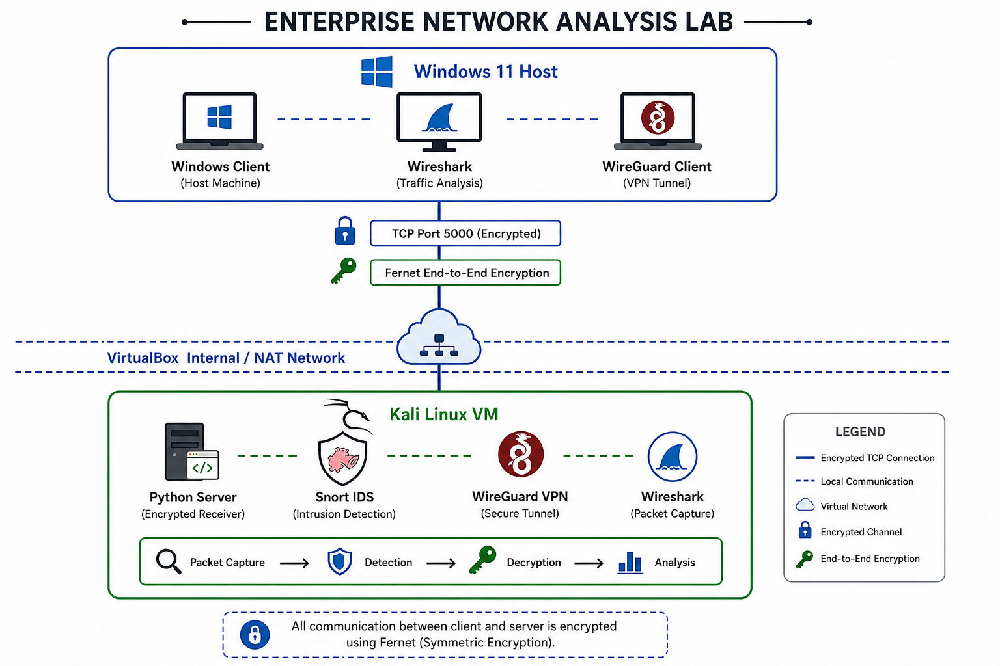
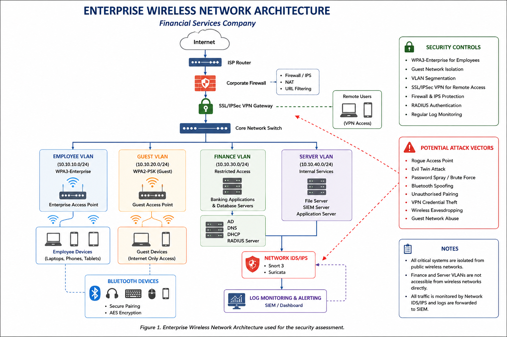
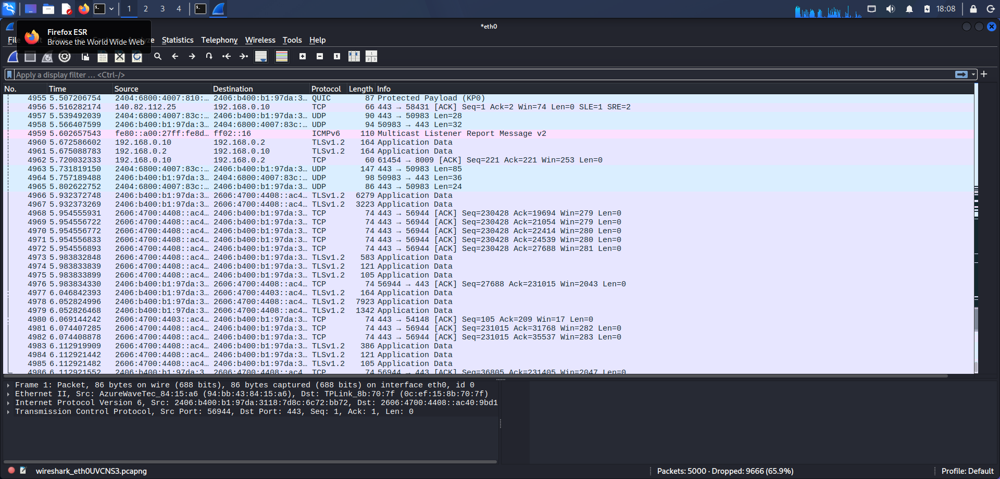
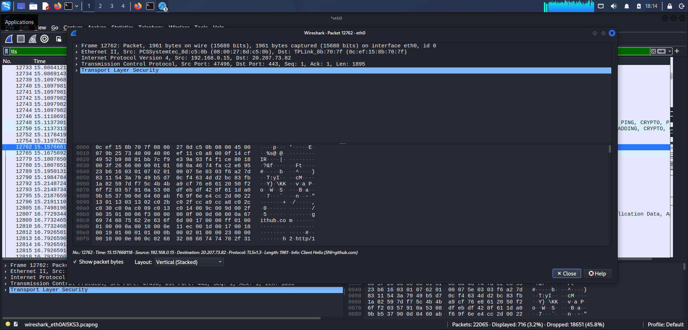
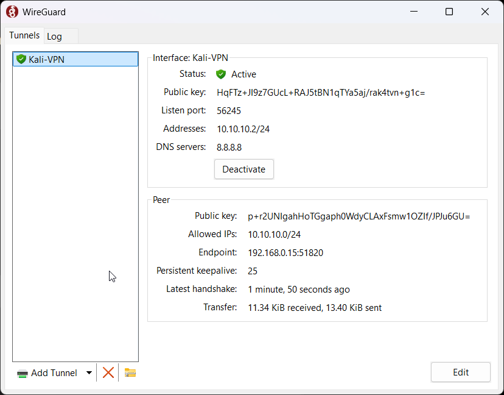
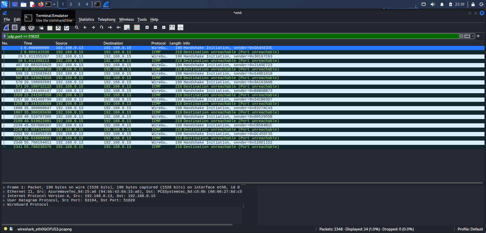
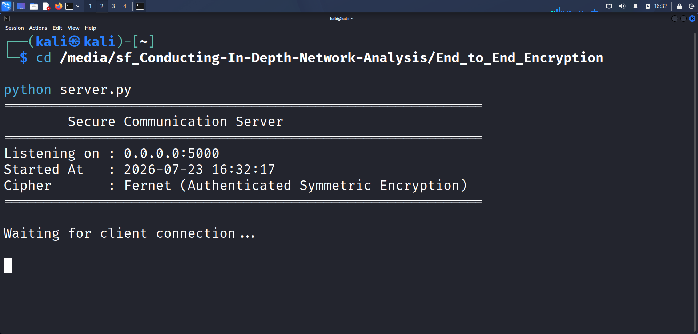
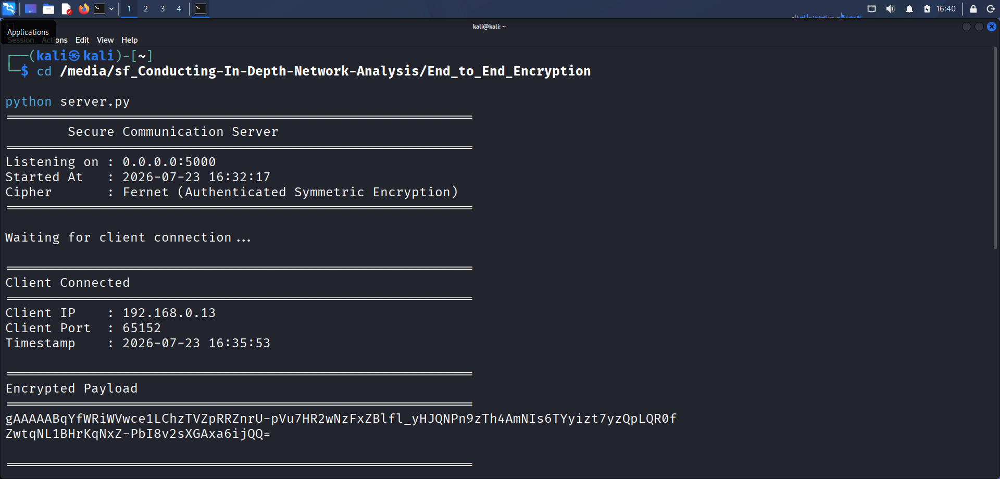
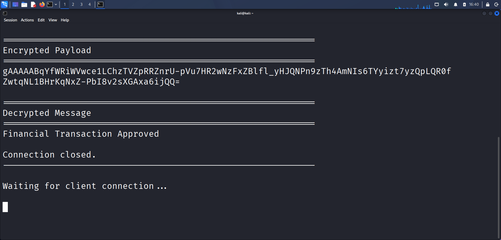
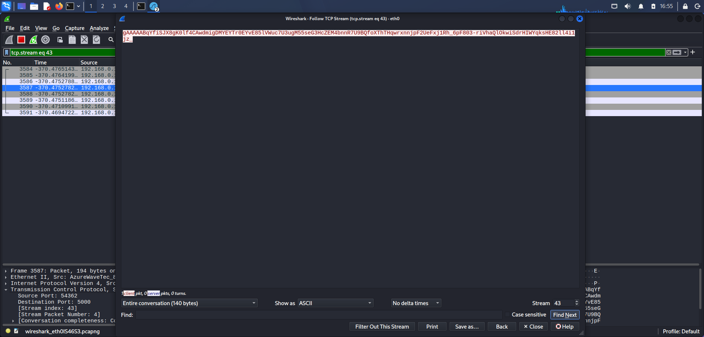

# 🛡️ Conducting In-Depth Network Analysis

> Enterprise Cybersecurity Lab demonstrating secure wireless communication, network monitoring, intrusion detection, VPN implementation, traffic analysis, and secure data transmission.
---

## 🏗️ Enterprise Lab Architecture

The following diagram illustrates the enterprise-style lab environment implemented for secure wireless communication, encrypted data transmission, VPN connectivity, and network traffic analysis.

  

> **Figure 1:** Enterprise Network Analysis Lab architecture showing the interaction between the Windows host, Kali Linux virtual machine, encrypted TCP communication, WireGuard VPN, Snort IDS, Wireshark, and Fernet-based end-to-end encryption.

---

# Project Overview

This project was developed as part of my Cybersecurity On-the-Job Training (OJT) at **Spinnaker Analytics**.

The objective was to analyze, implement, test, and document multiple wireless communication security mechanisms using practical cybersecurity tools instead of theoretical explanations.

The project combines offensive and defensive cybersecurity techniques including packet analysis, IDS monitoring, encrypted communication, VPN implementation, and enterprise security documentation.

---

# ✨ Key Features

- Enterprise-style Network Architecture
- Practical Wireless Security Assessment
- Snort Intrusion Detection
- WireGuard VPN Deployment
- TLS Traffic Analysis
- End-to-End Encryption using Fernet
- Wireshark Packet Analysis
- Technical Documentation
- Practical Evidence Collection

---

## About the Author

Cybersecurity-focused MCA graduate currently completing an On-the-Job Training (OJT) program at Spinnaker Analytics.

This repository demonstrates hands-on implementation of network analysis, intrusion detection, secure communication, VPN technologies, and cybersecurity documentation using enterprise-inspired workflows.

---

## Project Statistics

| Metric                 | Value         |
| ---------------------- | ------------- |
| Programming Language   | Python 3      |
| Virtual Environment    | Kali Linux VM |
| Operating System       | Windows 11    |
| IDS                    | Snort         |
| VPN                    | WireGuard     |
| Encryption             | Fernet        |
| Packet Analyzer        | Wireshark     |
| Communication Protocol | TCP           |

---

## 📊 Project Summary

| Category | Details |
|----------|----------|
| Project Type | Enterprise Network Security Lab |
| Duration | OJT Portfolio Project |
| Focus Area | Wireless Security & Network Analysis |
| Programming Language | Python |
| Security Tools | Wireshark, Snort, WireGuard |
| Encryption | Fernet (Symmetric Encryption) |
| Operating Systems | Windows 11, Kali Linux |
| Virtualization | Oracle VirtualBox |

---

## Project Progress

- ✅ Environment Setup
- ✅ Wireshark Analysis
- ✅ TLS Traffic Inspection
- ✅ Snort IDS Configuration
- ✅ WireGuard VPN
- ✅ End-to-End Encryption
- 🚧 Documentation
- ⏳ Final Report

---

# Table of Contents

- [Project Overview](#project-overview)
- [Objectives](#objectives)
- [Architecture](#enterprise-lab-architecture)
- [Workflow](#project-workflow)
- [Repository Structure](#repository-structure)
- [Technologies Used](#technologies-used)
- [Modules Completed](#modules-completed)
- [Practical Demonstrations](#practical-demonstrations)
- [Screenshots](#screenshots)
- [Skills Demonstrated](#skills-demonstrated)
- [Challenges & Solutions](#challenges--solutions)
- [Future Improvements](#future-improvements)
- [Resume Highlights](#resume-highlights)

---

# Objectives

- Analyze wireless network traffic
- Monitor network communications using Wireshark
- Implement Intrusion Detection using Snort
- Analyze encrypted TLS traffic
- Secure communication using WireGuard VPN
- Develop an End-to-End Encrypted Communication application
- Validate encrypted network traffic
- Produce enterprise-quality documentation

---

# 🖥️ Lab Environment

| Component | Configuration |
|-----------|---------------|
| Host Machine | Windows 11 |
| Virtual Machine | Kali Linux |
| Hypervisor | Oracle VirtualBox |
| Network | Internal / NAT |
| Packet Analysis | Wireshark |
| IDS | Snort |
| VPN | WireGuard |
| Programming | Python 3 |
| Encryption | Fernet |

---

# 🏢 Enterprise Wireless Network Design

The following architecture represents the secure enterprise wireless infrastructure that served as the reference design for this security assessment.

> **Figure 2.** Enterprise wireless network architecture showing VLAN segmentation, VPN access, IDS/IPS monitoring, Bluetooth security, SIEM integration, and network security controls.

---

# Project Workflow

1. Environment Preparation
2. Network Traffic Analysis
3. Snort IDS Configuration
4. TLS Packet Inspection
5. WireGuard VPN Deployment
6. End-to-End Encryption Implementation
7. Network Traffic Validation
8. Security Documentation

---

# Repository Structure

Conducting-In-Depth-Network-Analysis
│
├── Architecture
├── Configurations
├── Detection
├── Documentation
├── End_to_End_Encryption
├── Logs
├── Policies
├── Python
├── References
├── Reports
├── Screenshots
└── Testing

# 🛠️ Technologies Used

## Operating Systems

- Windows 11
- Kali Linux

---

## Programming Language

- Python 3

---

## Networking

- TCP/IP
- TLS
- Virtual Networking
- Packet Analysis

---

## Security Tools

- Wireshark
- Snort IDS
- WireGuard VPN

---

## Cryptography

- Fernet (Symmetric Encryption)
- Python Cryptography Library

---

## Virtualization

- Oracle VirtualBox

---

## Python Libraries

- socket
- cryptography
- datetime
- threading
- os

# 📋 Modules Completed

| Module | Practical Implementation | Evidence Collected |
|---------|:-----------------------:|:------------------:|
| Environment Setup | ✅ | ✅ |
| Wireshark Traffic Analysis | ✅ | ✅ |
| TLS Packet Analysis | ✅ | ✅ |
| Snort IDS | ✅ | ✅ |
| WireGuard VPN | ✅ | ✅ |
| End-to-End Encryption | ✅ | ✅ |
| Network Validation | ✅ | ✅ |
| Documentation | 🚧 | 🚧 |
| Final Report | ⏳ | ⏳ |
---

# Practical Demonstrations

## TLS Traffic Analysis

- Captured TLS Client Hello
- Captured TLS Server Hello
- Examined encrypted application data
- Verified encrypted communication

---

## WireGuard VPN

- VPN tunnel configuration
- Secure communication
- Connectivity validation
- Packet verification

---

## End-to-End Encryption

Features implemented:

- Symmetric encryption using Fernet
- Interactive secure client
- Secure TCP server
- Encrypted message transmission
- Automatic decryption
- Wireshark packet validation

---

# 📸 Project Gallery

## Wireshark & TLS Analysis

| Wireshark Capture | TLS Packet Details |
|-------------------|--------------------|
|  |  |

---

## WireGuard VPN

| Client Connected | Packet Capture |
|------------------|----------------|
|  |  |

---

## End-to-End Encryption

| Server Waiting | Encrypted Payload |
|----------------|-------------------|
|  |  |

| Decrypted Message | Follow TCP Stream |
|-------------------|-------------------|
|  |  |

---

# 🎯 Skills Demonstrated

| Domain | Skills |
|---------|--------|
| Network Security | Packet Analysis, Secure Communication |
| Traffic Analysis | Wireshark, TCP Inspection |
| Intrusion Detection | Snort IDS |
| VPN Technologies | WireGuard |
| Programming | Python Socket Programming |
| Cryptography | Fernet Symmetric Encryption |
| Documentation | Technical Writing |
| Security Validation | Traffic Capture & Analysis |
---

# Challenges & Solutions

| Challenge | Solution |
|------------|----------|
| No physical Wi-Fi adapter | Used packet analysis and enterprise documentation |
| No Bluetooth hardware | Documented monitoring strategy and limitations |
| Secure communication validation | Built custom encrypted client/server application |
| Traffic verification | Validated using Wireshark packet captures |

---

# 🚀 Future Improvements

### Security

- Suricata IDS Integration
- Certificate-Based Authentication
- AES-GCM Encryption

### Monitoring

- Splunk Log Forwarding
- SIEM Integration

### Networking

- Multi-Client Secure Communication
- Automated Security Testing

---

# 💼 Resume Highlights

This project demonstrates practical experience in:

- Enterprise Network Security
- Wireless Communication Security
- VPN Deployment
- Intrusion Detection Systems
- Packet Analysis using Wireshark
- Python-Based Security Tool Development
- End-to-End Encryption
- Security Documentation & Reporting

---

# 📚 References

- [Wireshark Official Documentation](https://www.wireshark.org/docs/)
- [Snort 3 Official Documentation](https://docs.snort.org/)
- [WireGuard Official Documentation](https://www.wireguard.com/)
- [Python Cryptography Documentation](https://cryptography.io/en/latest/)

---

# License

This repository is intended for educational, training, and portfolio purposes.

---

⭐ If you found this repository interesting, feel free to explore the code and documentation.

Built as part of my Cybersecurity Portfolio.